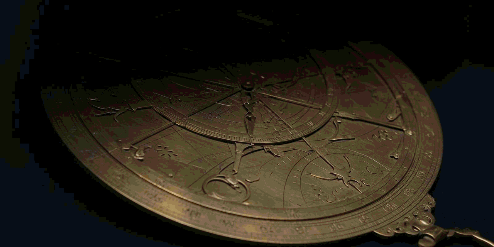
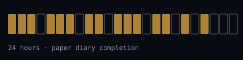
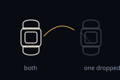
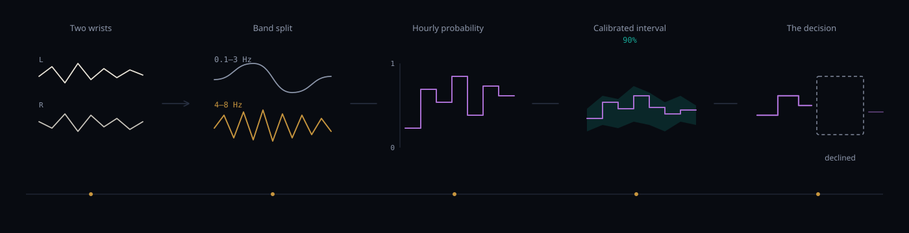
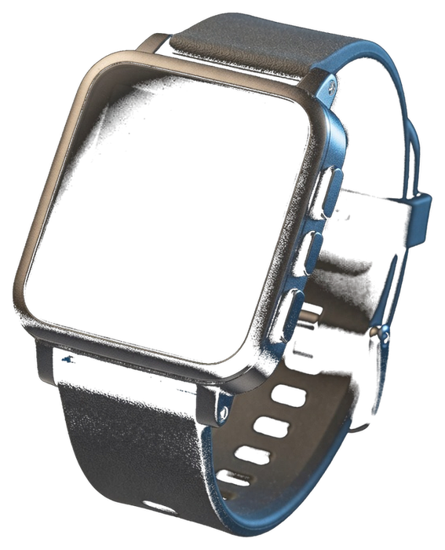
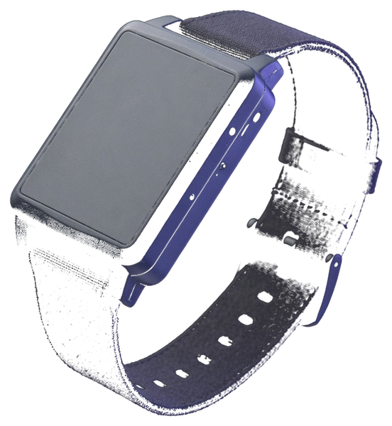
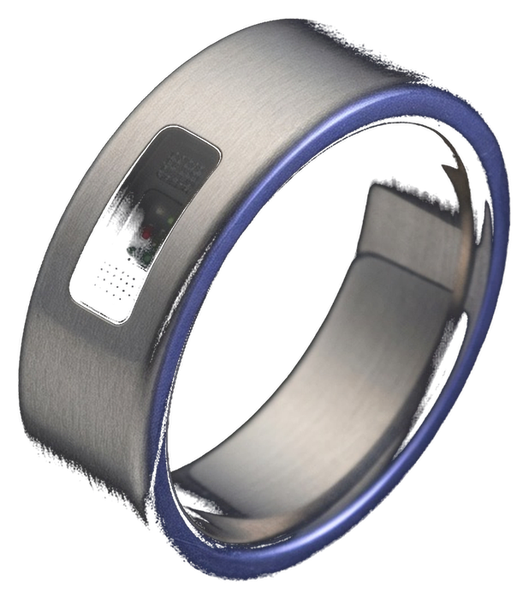

<div align="center">


# Astrolabe

**A Parkinson's motor diary that tells you when it doesn't know.**

[**Live demo**](https://astrolabe-flame.vercel.app) ·
[**Watch (2 min)**](https://astrolabe-flame.vercel.app/astrolabe-demo.mp4) ·
[**Technical report (PDF)**](https://astrolabe-flame.vercel.app/astrolabe-technical-report.pdf) ·
[**Findings**](docs/FINDINGS.md)


<br/>



</div>

---

Parkinson's symptoms fluctuate hour to hour, and treatment decisions depend on
knowing *when*. The paper diary meant to record that is abandoned within days —
in this cohort only **61.6%** of possible hours carry an entry, *with* research
staff supporting the process.

Astrolabe reconstructs the missing hours from bilateral wrist accelerometry, and
refuses wherever the evidence cannot carry an answer.

> *"My meds felt off all week. My neurologist asked when it was worse and I
> honestly couldn't tell her. I'd stopped filling in the diary by Wednesday."*

<p align="center">
  
</p>

## What holds up

Every figure is measured on participants the model never trained on.

| | | |
|---|---|---|
| **0.903** | achieved interval coverage | against a 0.90 target, 11 held-out participants |
| **0.697 ± 0.075** | tremor AUC | 55 held-out participants |
| **0.713 → 0.825** | accuracy as it answers less | full set vs most-confident quarter |
| **12.4% → 77.3%** | hours declined, one wrist vs two | holding the same error budget |

And what does not:

| | | |
|---|---|---|
| **0.684** | 7-state motor scale, ordinal MAE | worse than a **0.594** constant |
| **0.550** | median *within-participant* tremor AUC | the figure a diary is judged on |

The subjective motor scale does not generalise across people, so **we do not
predict it**. It is shown as reported by the patient, or as an explicit
abstention — never as inferred. On the demo participant-day the model declines
all 114 steps. That is the system working.

## Why this is the interesting part

Three decisions distinguish this from a model with an error bar bolted on.

**Coverage is earned, not asserted.** Requesting 90% of posterior mass does not
give 90% empirical coverage. The interval mass is swept on participants held out
of *both* the fit and the test fold until achieved coverage reaches target.

**Abstention holds an error budget, not a rate.** Tuning to a fixed abstention
rate guarantees every sensor configuration declines equally often — so a
degraded one *cannot* show degradation. Fixing the error budget instead means a
worse configuration can only comply by answering less.

**We report the bugs that flattered us.** Calibration fitted on one
representation and applied to another gave 0.535 coverage against a 0.90 target.
Rate-tuned abstention made losing a wrist look like an improvement. Both are in
[the report](https://astrolabe-flame.vercel.app/astrolabe-technical-report.pdf).

<p align="center">
  
</p>

## Try it

```bash
git clone https://github.com/MohammadSadeghSalehi/astrolabe
cd astrolabe/app && npm install && npm run build && npm start
```

Or use the [live demo](https://astrolabe-flame.vercel.app): pick **COPS-33**
(answers confidently), then **COPS-29** (declines every step). Same model, same
pipeline, opposite behaviour.

| | |
|---|---|
| Landing | `/` |
| Day view | `/day` |
| Profile & devices | `/profile` |
| Clinician handoff | `/clinician` |

## How it works

<p align="center">
  
</p>

```
both wrists ──▶ band split ──▶ ordinal ──▶ HMM ──▶ credible ──▶ answer
  100 Hz        0.1–3 Hz      emissions   forward-  interval    or decline
                4–8 Hz                    backward
```

Gradient-boosted cumulative classifiers (Frank–Hall) give ordinal emissions; the
class prior is divided out so the chain does not count it twice; a hidden Markov
model over the day recovers the posterior by forward–backward in log space; the
shortest contiguous credible interval is taken at a mass calibrated on held-out
truth. The maths is in the [technical report](docs/whitepaper/astrolabe.tex).

## Devices

Generic form factors the product is designed around — **not** partnered
consumer brands. Real COPS recordings used research-grade GENEActiv units at
100 Hz, bilateral.

<p align="center">
  
  &nbsp;&nbsp;
  
  &nbsp;&nbsp;
  
</p>

## Repository

```
app/          Next.js 16 · the product
  public/brand/  logo, pipeline, devices, OG image
ml/           feature pipeline, models, calibration, bundle emission
contract/     the frozen output contract + emitted bundles
docs/         FINDINGS.md · DATA.md · DESIGN.md · whitepaper/
scripts/      dataset download, diary extraction, baselines, checks
supabase/     schema, seed, migrations
```

Every figure quoted anywhere regenerates from a named script — see
[Reproducibility](docs/FINDINGS.md#reproducing).

## Data

**COPS** — Continuous Observation of Parkinsonian Symptoms. 66 people with
Parkinson's, bilateral wrist accelerometry at 100 Hz (GENEActiv) paired with
hourly symptom diaries. **CC-BY 4.0**, commercial use permitted with attribution:

> Nesser, T. et al. *COPS — Continuous Observation of Parkinsonian Symptoms.*
> OSF (2025). https://doi.org/10.17605/OSF.IO/5XVWN

## Limitations

- **46 of 66 participants have deep brain stimulation.** An advanced,
  device-treated cohort, not a newly diagnosed one.
- **Labels are hourly.** The model infers at 10-minute resolution; every metric
  is scored at the hourly resolution the labels actually have.
- **No causal claim.** Trajectory shape around medication times is temporal
  alignment, not treatment response.
- **Pooled AUC flatters the tremor result.** Median within-participant AUC is
  0.550; much of the pooled figure separates tremor-dominant people from others.
- **Not a medical device.** No diagnostic, dosing or treatment claim is made.

## Licence

Code MIT · Data CC-BY 4.0, © the COPS authors.
